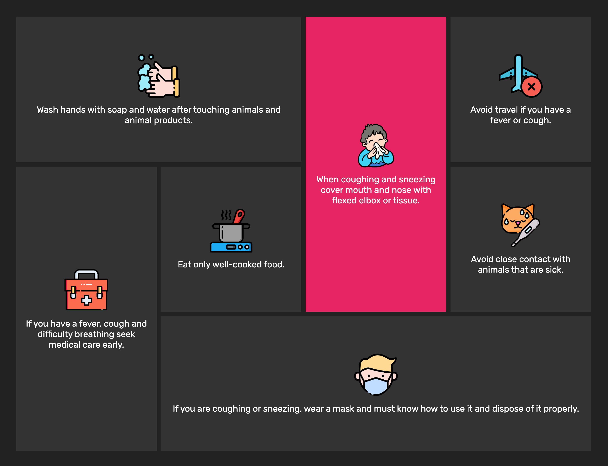
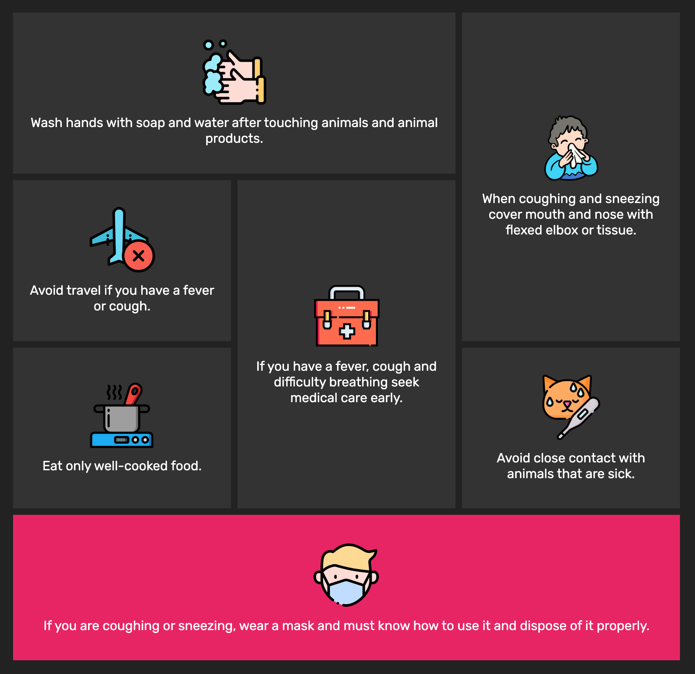
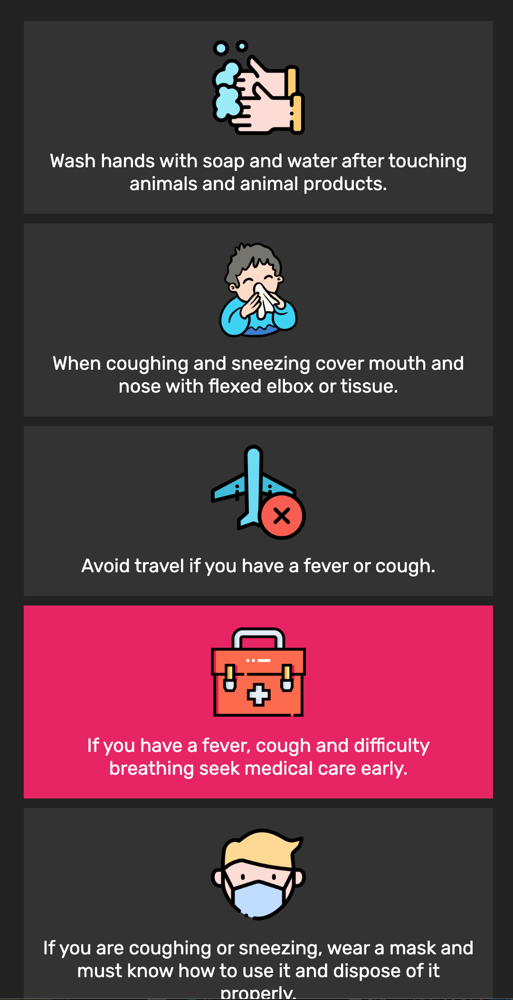

# Corona virus preventive advices, built with Grid and Flexbox

A small website with Corona virus preventive advices.

Icons are from flaticon [https://www.flaticon.com]

- Freepik [https://www.flaticon.com/authors/freepik]
- Smashicons [https://www.flaticon.com/authors/smashicons]

Media queries have been added for max-width.

## Screenshots

Large screen

Medium screen

Mobile

## Author

- Albert Stjärne (https://github.com/AlbertStjarne)
